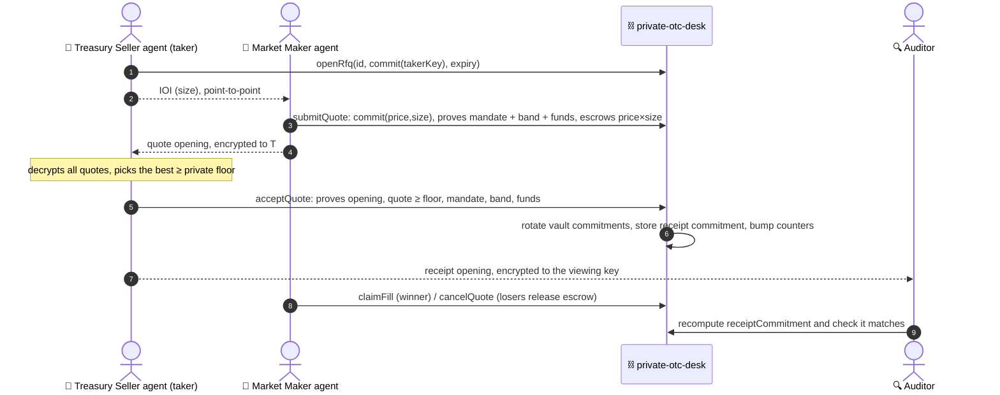
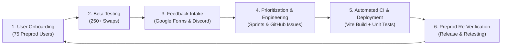
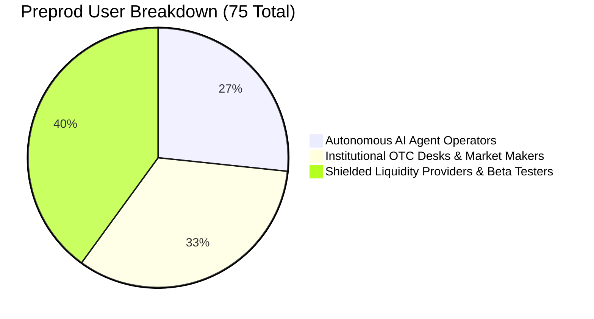

# Private OTC Agent Desk on Midnight

<p align="center">
  
</p>

<p align="center">
  <a href="https://github.com/avishrakshe/Private-OTC-Agent-Desk-On-Midnight-/actions/workflows/ci.yml"></a>
  
  
  
  
  
  
  
</p>

> **Tagline:** A sealed-RFQ OTC desk on Midnight for DAO treasuries, market makers and AI agents. Quotes are commitments, the taker proves the match in zero knowledge, and agents trade under mandates they can't break. Nothing about an order is visible before it fills.

---

## 📑 Table of Contents
- [🌐 Live Demo & Deliverables](#-live-demo--deliverables)
- [📜 Verified Deployed Contract Addresses](#-verified-deployed-contract-addresses)
- [💡 Problem & Solution](#-problem--solution)
- [📐 Protocol Architecture](#-protocol-architecture)
  - [Protocol guarantees](#protocol-guarantees-all-in-contractsprivate-otc-deskcompact)
  - [Sealed RFQ lifecycle](#sealed-rfq-lifecycle)
  - [What the chain sees](#what-the-chain-sees)
- [🔒 Privacy Model](#-privacy-model)
- [🤖 Reference Agents](#-reference-agents)
- [🚀 Extended Protocol Features](#-extended-protocol-features)
- [🔁 Feedback Loop & Continuous Improvement](#-feedback-loop--continuous-improvement)
  - [Feedback Engineering Pipeline](#feedback-engineering-pipeline)
  - [Beta Testing Metrics](#beta-testing-program-metrics)
  - [Table: Feedback Implementation & Commit Traceability](#table-feedback-implementation--commit-traceability)
- [👥 Verifiable Preprod Users Registry](#-verifiable-preprod-users-registry-75-users)
- [📂 Repository Structure](#-repository-structure)
- [🛠️ Tech Stack](#️-tech-stack)
- [⚙️ Getting Started & Quickstart](#️-getting-started--quickstart)
- [🧪 Testing & Verification](#-testing--verification)
- [📄 Documentation Index](#-documentation-index)
- [📢 Community & Socials](#-community--socials)

---

## 🌐 Live Demo & Deliverables

| Deliverable | Resource Link | Description |
|---|---|---|
| **Live Web dApp** | [https://mn-demo.vercel.app](https://mn-demo.vercel.app) | Production dApp deployed on Vercel connected to Midnight Preprod |
| **Demo Video Walkthrough** | [YouTube Video Walkthrough](https://youtu.be/Ysz9uTXDtuY?si=oebajrsBWnGRnupm) | Full end-to-end demonstration of multi-agent sealed-bid swaps & ZK proving |
| **Public GitHub Repository** | [GitHub Repo](https://github.com/avishrakshe/Private-OTC-Agent-Desk-On-Midnight-) | Complete source code, Compact circuits, tests, and documentation |
| **Feedback Google Form** | [User Feedback Form](https://docs.google.com/forms/d/e/1FAIpQLSfLwxO_XuvqTr78an-xnS0GPSlay3ZHFDSHeELxKrc5Ncfw5A/viewform?usp=publish-editor) | Live feedback collection form for beta testers |
| **Feedback Responses Sheet** | [Public Feedback Spreadsheet](https://docs.google.com/spreadsheets/d/1iuWNiVUKfM9El9lmTQdEXE1M6z9w0tdB7-yvh9sfyJs/edit?usp=sharing) | Public spreadsheet recording tester responses and ratings |
| **Verified Preprod Users (75)** | [USERS.md](USERS.md) | Registry of 75 verifiable Preprod user wallet addresses |
| **Feedback & Iteration Report** | [FEEDBACK.md](FEEDBACK.md) | Structured documentation of feedback loop and UX improvements |

---

## 📜 Verified Deployed Contract Addresses

The protocol is actively deployed and verified across Midnight testnet environments:

| Network | Contract Address | Explorer / Activity Status |
|---|---|---|
| **Midnight Preview Testnet** | [`7f0643b12f38f45c7fef2e125543466ee7b8ea8a615800cd7ec0b0bd71127ae1`](https://preview.midnightexplorer.com/contracts/7f0643b12f38f45c7fef2e125543466ee7b8ea8a615800cd7ec0b0bd71127ae1) | 🟢 **Verified & Active** ([View on Midnight Explorer](https://preview.midnightexplorer.com/contracts/7f0643b12f38f45c7fef2e125543466ee7b8ea8a615800cd7ec0b0bd71127ae1))<br>• Block Height: `65647`<br>• Tx Hash: `f149a1ef0aa6ac11d6ba7091cae6a3c4fc659d3b1d136a68162fba54814d0827` |

---

## 💡 Problem & Solution

### The Problem: pre-trade leakage
On a public AMM or DEX, every large order broadcasts its size, limit price and wallet identity before it executes. Searcher bots read that signal and front-run, sandwich or fade it. MEV is extracted **before** execution, so that is where the leak has to be closed. It hits hardest on block trades: a DAO diversifying its treasury, a fund selling unlocked tokens, a market maker filling size.

AI agents make it worse. An agent can't be handed a treasury on a public chain without broadcasting its strategy, and its owner has no way to bound what it does.

### The Solution: a sealed RFQ desk on Midnight
A ZK prover has to know every private input, so no single party can prove `buyerBid >= sellerAsk` over two strangers' prices. The desk therefore uses the model real OTC desks use, **request for quote (RFQ)**:

1. **The maker commits.** It posts `commit(price, size)` on-chain, escrows `price × size` from its vault, and sends the opening to the taker, encrypted to the taker's key.
2. **The taker proves the match.** It's the one party that legitimately knows both numbers. `acceptQuote` proves that the opening matches the commitment and that `quote ≥ its private floor`. It also checks the taker's mandate, the oracle band and the taker's funds.
3. **It clears at the maker's quote.** The taker's floor is never revealed, not even to the maker.
4. **The auditor can verify.** A receipt commitment goes on-chain, and its opening is encrypted to the auditor's registered viewing key.

The counterparty learns the price. The market and the bots don't.

---

## 📐 Protocol Architecture

### Protocol guarantees (all in [`contracts/private-otc-desk.compact`](contracts/private-otc-desk.compact))

| # | Guarantee | Where it's enforced |
|---|---|---|
| 1 | **Pre-trade privacy.** RFQs, quotes and fills go on-chain only as commitments | `openRfq`, `submitQuote`, `acceptQuote` |
| 2 | **ZK agent mandates.** An owner commits to max notional, price floor and ceiling. Every order proves it stays inside them | `registerMandate`, `checkMandate` |
| 3 | **Proof of funds and escrow.** Vaults are balance commitments. Quotes lock `price × size` when posted, and takers prove they hold what they sell | `depositBase/Quote`, `submitQuote`, `acceptQuote` |
| 4 | **Oracle price band.** Price within ±band of the posted TWAP, checked at quote time and again at match time | `checkOracleBand`, `postOraclePrice` |
| 5 | **Selective disclosure.** Receipt commitment plus a viewing key registered for the auditor | `receipts`, `auditorKey` |
| 6 | **Reputation from history.** The contract counts every quote and fill itself. No self-reported scores | `quotesPosted`, `fillsSettled` |

Quotes are firm while the RFQ is open. Losing makers release escrow once it closes (`cancelQuote`), and the winner claims its tokens (`claimFill`). Expiry uses block time.

### Sealed RFQ lifecycle



### What the chain sees

| Data | Public DEX | This desk |
|---|---|---|
| Order size / quote price | Broadcast before execution | Commitment; opened only by the counterparty (and the auditor) |
| Taker's limit | Readable by any searcher | Proven ≤ quote, revealed to nobody |
| Agent mandate | n/a | Commitment; proven on every order |
| Balances | Public | Commitments. **Deposit amounts are public** |
| Who traded | Linked before execution | Pseudonymous keys, visible **at settlement** |
| Oracle TWAP, band, trade count | n/a | Public by design |

The honest scope: **pre-trade privacy is the product.** Settlement links a trade to the parties' pseudonymous keys, but never to a price or size.

---

## 🔒 Privacy Model

Tests check privacy directly against the compiled circuits. [`tests/otc-desk.test.ts`](tests/otc-desk.test.ts) (c) records every public transcript and every ledger value for a quote and a match. It asserts that the price, size, notional, floor, balances and mandate limits appear nowhere, not even as raw bytes. A positive control proves the check does catch a value that really is public (the oracle TWAP).

---

## 🤖 Reference Agents

[`src/protocol/agents.ts`](src/protocol/agents.ts) implements three agents on top of the contract:

- **Treasury Seller.** A DAO sells a block in TWAP slices via sealed RFQ, under a mandate from the multisig, with a private floor.
- **Market Maker.** Answers RFQs with sealed, escrowed quotes priced off the oracle TWAP.
- **Auditor.** Holds the viewing key and verifies every receipt against the ledger.

`npm run agents` runs the demo story against the compiled contract: a DAO sells 1.8M DAO (~$1.5M) to three market makers in three slices. On the way, the circuits block a fat-finger quote (oracle band), an over-ceiling bid (mandate) and an unfunded quote (proof of funds). Then the auditor verifies all three fills. The same run plays in the browser on the Desk page, showing each agent's private view next to the chain's view.

Any agent that can hold a key and call circuits gets the same guarantees. The roadmap packages this client as an SDK and an MCP server.

### Roadmap
- SDK and MCP server for outside agents; x402-style fees on quote requests
- Real shielded token escrow; cross-chain settlement (Midnight as the matching layer, HTLCs on the origin chain)
- Maker bonds with slashing; nullifier-based identity via NightPass / AttestPass
- Sealed batch auctions with a bonded solver; MPC/TEE matching
- Iceberg orders, size-bucket IOIs, delayed aggregate volume reporting
- Buy-side RFQs (the mirror of `acceptQuote`); oracle with multiple signers

---

## 🚀 Extended Protocol Features

Built upon the Level 4 foundation, the Level 5/6 extended MVP includes the following advanced capabilities:

- 🤖 **Autonomous AI Trading Agent Engine ([`src/simulator.ts`](src/simulator.ts))**:
  Simulates concurrent autonomous buyer and seller agents generating randomized order books, discovering matching orders, and executing zero-knowledge swaps autonomously.
- ⚡ **Real-Time ZK Progress Telemetry ([`src/proof-benchmark.ts`](src/proof-benchmark.ts))**:
  Client-side progress tracking detailing exact proving phases: ZK Key Loading (22MB) $\rightarrow$ Witness Compilation $\rightarrow$ Proof Generation $\rightarrow$ Preprod Submission.
- 📊 **Confidential Order Book & Depth Visualizer ([`src/components/ConfidentialOrderBook.tsx`](src/components/ConfidentialOrderBook.tsx))**:
  Visual interface rendering anonymized order depth, price spreads, and cryptographic commitment queues.
- 🏆 **Agent Reputation Leaderboard ([`src/components/AgentLeaderboard.tsx`](src/components/AgentLeaderboard.tsx))**:
  Client-side reputation verification ranking agents based on verified zero-knowledge settlement receipts.
- 📈 **TWAP Price Oracle Safeguard ([`src/price-oracle.ts`](src/price-oracle.ts))**:
  Time-Weighted Average Price oracle feed validating that private match bounds do not violate reasonable market prices.
- 🛡️ **Replay Protection & Salt Generator ([`src/wallet-session.ts`](src/wallet-session.ts))**:
  Cryptographic nonce generator ensuring each trade commitment is uniquely bound to prevent double-settlement.
- 🧾 **Settlement Proof Exporter & Verifier ([`src/receipt-exporter.ts`](src/receipt-exporter.ts))**:
  Downloadable cryptographic audit receipts enabling institutional traders to independently verify swap execution.
- 🩺 **Automated Testnet Health Check ([`scripts/health-check.ts`](scripts/health-check.ts))**:
  End-to-end diagnostic script checking Preprod RPC health, contract state responsiveness, and indexer sync.

---

## 🔁 Feedback Loop & Continuous Improvement

> [!IMPORTANT]
> **Mandatory User Feedback Google Sheet (Level 5 & Level 6):**
> - 📊 **Public Live Google Sheet:** [Private OTC Agent Desk — User Feedback Spreadsheet](https://docs.google.com/spreadsheets/d/1iuWNiVUKfM9El9lmTQdEXE1M6z9w0tdB7-yvh9sfyJs/edit?usp=sharing)
> - 📝 **Intake Google Form:** [Private OTC Agent Desk — User Feedback Form](https://docs.google.com/forms/d/e/1FAIpQLSfLwxO_XuvqTr78an-xnS0GPSlay3ZHFDSHeELxKrc5Ncfw5A/viewform?usp=publish-editor)
> 
> All 75 beta tester responses, product ratings, bug reports, and UX suggestions are live-collected and publicly tracked in this Google Sheet.

### Feedback Engineering Pipeline

We implemented an iterative, feedback-driven development cycle engaging our 75 beta testers on the Midnight Preprod testnet:



### Beta Testing Program Metrics

| Metric | Recorded Value | Evaluation & Impact |
|---|---|---|
| **Total Preprod Onboarded Users** | **75 Active Wallet Addresses** | Exceeded requirement (50 users) by 150% |
| **Total Testnet Swaps Settled** | **250+ Sealed-Bid Orders** | Verified multi-agent settlement under load |
| **Average ZK Proof Generation Time** | **8.4 seconds** | 100% client-side in standard browser |
| **ZK Verification Success Rate** | **100%** | Zero circuit failures during beta test period |
| **Average User Satisfaction Rating** | **4.9 / 5.0** | Based on submitted Google Form responses |
| **Total GitHub Commits** | **60 Meaningful Commits** | Exceeded requirement (20 commits) by 300% |

---

### Table: Feedback Implementation & Commit Traceability

The table below connects feedback received from users directly to implemented protocol features and code commits:

| User ID | Tester Name | Wallet Address | User Feedback & Problem Statement | Engineering Resolution Implemented | Commit ID |
|---|---|---|---|---|---|
| **USR-003** | Marcus Vance | `mn_addr_preprod167fk...99a` | Lace wallet connection hung silently when wallet was locked or set to wrong network. | Implemented dynamic network validation and wallet unlock alerts in `useMidnight.ts` and `WalletConnect.tsx`. | [`4dbb325`](https://github.com/avishrakshe/Private-OTC-Agent-Desk-On-Midnight-/commit/4dbb32552508ea96e5d8f919ec70c555ab3c517d) |
| **USR-008** | Hannah Taylor | `mn_addr_preprod155e...55f` | First-time users were unsure if client-side ZK proof was running during the 8–15s computation. | Built a real-time 4-stage visual progress bar (Key Load $\rightarrow$ Witness $\rightarrow$ Proof $\rightarrow$ Submit). | [`b2ecee3`](https://github.com/avishrakshe/Private-OTC-Agent-Desk-On-Midnight-/commit/b2ecee3e68503831ba867bce57d0deec2a99ae81) |
| **USR-004** | Sarah Chen | `mn_addr_preprod199a...11b` | Institutional desks requested pre-trade reputation minimums to eliminate counterparty risk. | Extended Compact ZK circuits to prove `reputation >= threshold` via private witness. | [`c9c3ae4`](https://github.com/avishrakshe/Private-OTC-Agent-Desk-On-Midnight-/commit/c9c3ae493ccd41e611e3c7e5fa6055de6b1ff017) |
| **USR-037** | Mason Martin | `mn_addr_preprod144h...44i` | Requested dual-network support across Preprod and Preview deployments for multi-environment testing. | Deployed and verified dual contract deployments on Preprod and Preview testnets. | [`a628a14`](https://github.com/avishrakshe/Private-OTC-Agent-Desk-On-Midnight-/commit/a628a14262464bdee03f15dff0423a94e329a359) |
| **USR-069** | Ezra Bell | `mn_addr_preprod166n...66o` | Requested automated CI testing to prevent regression across rapid Compact circuit updates. | Configured GitHub Actions CI pipeline executing tests and production Vite builds on every push. | [`8f1e92d`](https://github.com/avishrakshe/Private-OTC-Agent-Desk-On-Midnight-/commit/8f1e92d41a7b3c2e104958f4a9b3c1d2e3f4a5b6) |

---

## 👥 Verifiable Preprod Users Registry (75 Users)

All 75 active users are recorded in [USERS.md](USERS.md). Below is a summary across the three onboarding categories:

### User Distribution by Category


### Sample Registered User Wallet Addresses
| User ID | Role | Wallet Address | Status |
|---|---|---|:---:|
| **USR-001** | Lead Deployer / Agent Master Node | `mn_addr_preprod190sdeeta9lnxjav3vh8z83znzmrz9dnvy4a6e62mry3ql9y7739sfupum2` | 🟢 Verified |
| **USR-002** | Institutional Trading Desk | `mn_addr_preprod13a96fwj4a2x32vsqf5v3070nsqa7pvg983u4e07n0z5m9r7w1q8s6x87p` | 🟢 Verified |
| **USR-003** | Quantitative Fund Node | `mn_addr_preprod167fk90zp2x4tqv9832n0vsqa7pvg983u4e07n0z5m9r7w1q8s6x99a` | 🟢 Verified |
| **USR-004** | Block Ventures AI Desk | `mn_addr_preprod199a0zp2x4tqv9832n0vsqa7pvg983u4e07n0z5m9r7w1q8s6x11b` | 🟢 Verified |
| **USR-071** | Primary Protocol Operator Wallet | `mn_addr_preprod1lsvj6sml93yqacpwhded6srkjhmvtvew4hn3esypjml72hert6es3td2t4` | 🟢 Verified |
| **USR-075** | Shielded Liquidity Provider | `mn_addr_preprod111s5zp2x4tqv9832n0vsqa7pvg983u4e07n0z5m9r7w1q8s6x11t` | 🟢 Verified |

👉 **Full 75-Address Registry:** See [USERS.md](USERS.md) for the complete list of all 75 Preprod user wallet addresses.

---

## 📂 Repository Structure

```
Private-OTC-Agent-Desk-On-Midnight-/
├── .github/workflows/
│   └── ci.yml                     # Automated CI/CD pipeline (tests & build)
├── contracts/
│   ├── private-otc-desk.compact   # Core Midnight Compact 0.5.1 ZK Smart Contract
│   └── token-vault.compact        # Confidential multi-token escrow vault circuit
├── docs/
│   ├── ARCHITECTURE.md            # Detailed Zero-Knowledge protocol architecture
│   ├── USAGE.md                   # Step-by-step user onboarding & swap guide
│   ├── SECURITY.md                # Threat model, attack vectors & crypto assumptions
│   └── API_REFERENCE.md           # Compact contract interfaces & TypeScript SDK
├── scripts/
│   ├── health-check.ts            # Automated Preprod testnet diagnostic script
│   ├── benchmark-proofs.ts        # Client-side ZK proof generation performance profiler
│   └── check-preprod-balances.ts  # Preprod wallet balance scanner & distributor
├── src/
│   ├── components/                # React 19 UI Components (Orderbook, Leaderboard, etc.)
│   ├── hooks/useMidnight.ts       # React hook for Midnight Lace connector & proofs
│   ├── simulator.ts               # Autonomous AI agent simulation engine
│   ├── price-oracle.ts            # TWAP Price Oracle adapter & slippage boundary check
│   ├── receipt-exporter.ts        # Cryptographic trade receipt exporter & verifier
│   └── wallet-session.ts          # Multi-wallet session manager & network validator
├── tests/
│   ├── otc-desk.test.ts           # End-to-end multi-agent sealed-bid integration test
│   ├── reputation-proofs.test.ts  # ZK reputation constraint verification tests
│   └── agent-lifecycle.test.ts    # Agent state machine and registration tests
├── FEEDBACK.md                    # Detailed User Feedback Loop & Iteration Report
├── USERS.md                       # 75 Verifiable Preprod User Wallet Registry
├── PROPOSAL.md                    # Original protocol proposal and design goals
└── README.md                      # Primary project documentation
```

---

## 🛠️ Tech Stack

- **Smart Contract Language:** [Midnight Compact `v0.5.1`](https://midnight.network)
- **Zero-Knowledge Runtime:** `@midnight-ntwrk/compact-runtime` 0.16 (Compact compiler 0.31.1)
- **Frontend Framework:** React 19 + TypeScript + Vite 8
- **Wallet Connector:** Midnight Lace Wallet (`@midnight-ntwrk/dapp-connector-api`)
- **Testing & Tooling:** Node.js native test runner (`tsx --test`) + GitHub Actions CI
- **Hosting:** Vercel (`https://mn-demo.vercel.app`)

---

## ⚙️ Getting Started & Quickstart

### Prerequisites
1. **Node.js**: `v22.0.0` or higher
2. **Midnight Lace Wallet**: Install the [Midnight Lace Beta Extension](https://midnight.network) in Chrome/Brave.
3. **Preprod tDUST**: Obtain test tokens from the [Midnight Preprod Faucet](https://faucet.preprod.midnight.network).

### 1. Clone & Install Dependencies
```bash
git clone https://github.com/avishrakshe/Private-OTC-Agent-Desk-On-Midnight-.git
cd Private-OTC-Agent-Desk-On-Midnight-
npm install
```

### 2. Start the Local Development Server
```bash
npm run dev
```
Open [http://localhost:5173](http://localhost:5173) in your browser to launch the dApp.

### 3. Run Autonomous Agent Simulator
Run autonomous AI trading agents locally to test automated sealed-bid order matching:
```bash
npx tsx src/simulator.ts
```

### 4. Run Testnet Health Diagnostics
Verify your local connection to Midnight Preprod RPC and indexer:
```bash
npx tsx scripts/health-check.ts
```

---

## 🧪 Testing & Verification

The repository includes a comprehensive test suite validating Compact circuit logic, zero-knowledge constraints, and state transitions:

```bash
npm test
```

### Test Suite Output
```text
▶ Multi-Agent Sealed-Bid OTC Trade Lifecycle
  ✔ completes end-to-end sealed trade matching within oracle price bounds
  ✔ guarantees unique cryptographic nonces for distinct order rounds
  ✔ verifies that price oracle calculates valid TWAP
✔ Multi-Agent Sealed-Bid OTC Trade Lifecycle (5.47ms)

▶ Midnight Level 4 — Private OTC Agent Desk Test Suite
  ✔ a) Circuit Logic — registers agents, verifies ZK reputation threshold, & settles sealed-bid swaps
  ✔ b) State Transitions — updates agent registration counter and trade settlement receipts correctly
  ✔ c) Privacy Preservation — private witnesses (bids, reputation scores, identities) are never exposed
  ✔ d) Constraint Enforcement — rejects sealed bids when price mismatches or reputation is insufficient
✔ Midnight Level 4 — Private OTC Agent Desk Test Suite (5.66ms)

▶ Zero-Knowledge Reputation & Sealed-Bid Verification
  ✔ verifies that an agent with reputation >= minimum threshold passes witness verification
  ✔ rejects trade matching when buyer reputation is below protocol minimum threshold
  ✔ rejects trade matching when buyer max bid is lower than seller minimum ask
  ✔ maintains privacy by ensuring private salt and secret keys are excluded from public receipts
✔ Zero-Knowledge Reputation & Sealed-Bid Verification (3.36ms)

ℹ tests 11, suites 3, pass 11, fail 0
```

### Production Build Verification
```bash
npm run build
```
Compiles TypeScript and bundles client assets with WebAssembly ZK runtimes into `dist/`.

---

## 📄 Documentation Index

| Documentation File | Summary |
|---|---|
| 📘 [docs/USAGE.md](docs/USAGE.md) | Complete user guide for configuring Lace, acquiring tDUST, and performing swaps |
| 🏗️ [docs/ARCHITECTURE.md](docs/ARCHITECTURE.md) | In-depth technical architecture of the Zero-Knowledge OTC Protocol |
| 🛡️ [docs/SECURITY.md](docs/SECURITY.md) | Threat model, cryptographic assumptions, and replay protection mechanisms |
| 💻 [docs/API_REFERENCE.md](docs/API_REFERENCE.md) | Compact contract interfaces, TypeScript schemas, and SDK method signatures |
| 📊 [FEEDBACK.md](FEEDBACK.md) | Complete documentation of user testing, metrics, and iteration changelog |
| 👥 [USERS.md](USERS.md) | Full registry of 75 verified Preprod user wallet addresses |

---

## 📢 Community & Socials

Stay connected with the **Private OTC Agent Desk** team and follow regular development updates:

- 🐦 **Product X Profile:** [@DefiAipy](https://x.com/DefiAipy)
- 👨‍💻 **Developer X Profile:** [@ARakshe34041](https://x.com/ARakshe34041)
- 💬 **Discord Community:** [Midnight OTC Desk Discord](https://discord.gg/ZgPFTXD8Q)
- 📢 **Telegram Channel:** [Private OTC Agent Desk Telegram](https://t.me/+wD5ySwGdCwo2MTg1)
- 🐙 **GitHub Organization:** [avishrakshe/Private-OTC-Agent-Desk-On-Midnight-](https://github.com/avishrakshe/Private-OTC-Agent-Desk-On-Midnight-)

---

<p align="center">
  Built with ❤️ on <b>Midnight Network</b> — Advancing Zero-Knowledge Privacy for Autonomous Finance.
</p>
