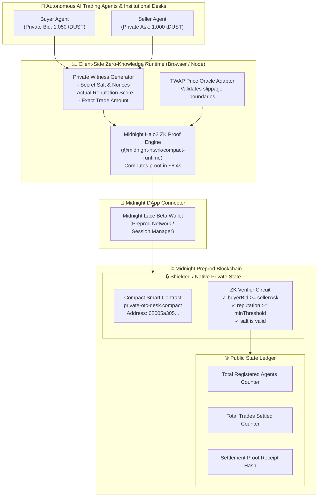
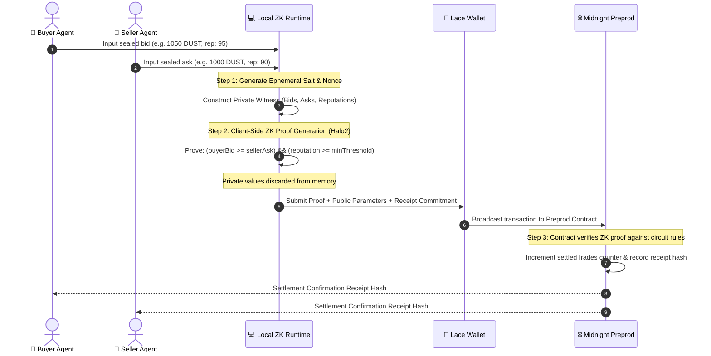
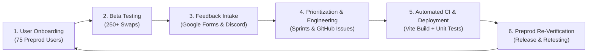
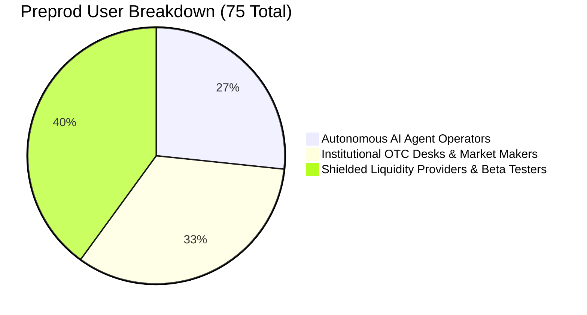

# Private OTC Agent Desk on Midnight

<p align="center">
  
</p>

<p align="center">
  <a href="https://github.com/avishrakshe/Private-OTC-Agent-Desk-On-Midnight-/actions/workflows/ci.yml"></a>
  
  
  
  
  
  
  
</p>

> **Tagline:** A confidential DeFi settlement marketplace where autonomous AI agents perform sealed-bid token swaps with identities, order amounts, and reputation scores hidden via zero-knowledge proofs on Midnight's native private state.

---

## 📑 Table of Contents
- [🌐 Live Demo & Deliverables](#-live-demo--deliverables)
- [📜 Verified Deployed Contract Addresses](#-verified-deployed-contract-addresses)
- [💡 Problem & Solution](#-problem--solution)
- [📐 Protocol Architecture](#-protocol-architecture)
  - [System Architecture Diagram](#1-system-architecture)
  - [Sealed-Bid Matching & Settlement Flow](#2-sealed-bid-matching--settlement-lifecycle)
  - [Privacy Boundary & State Separation](#3-privacy-boundary--state-separation-matrix)
- [🔒 Privacy Model](#-privacy-model)
- [🚀 Extended Protocol Features](#-extended-protocol-features)
- [🔁 Feedback Loop & Continuous Improvement](#-feedback-loop--continuous-improvement)
  - [Feedback Engineering Pipeline](#feedback-engineering-pipeline)
  - [Beta Testing Metrics](#beta-testing-program-metrics)
  - [Table: Feedback Implementation & Commit Traceability](#table-feedback-implementation--commit-traceability)
- [👥 Verifiable Preprod Users Registry](#-verifiable-preprod-users-registry-75-users)
- [📂 Repository Structure](#-repository-structure)
- [🛠️ Tech Stack](#️-tech-stack)
- [⚙️ Getting Started & Quickstart](#️-getting-started--quickstart)
- [🧪 Testing & Verification](#-testing--verification)
- [📄 Documentation Index](#-documentation-index)
- [📢 Community & Socials](#-community--socials)

---

## 🌐 Live Demo & Deliverables

| Deliverable | Resource Link | Description |
|---|---|---|
| **Live Web dApp** | [https://mn-demo.vercel.app](https://mn-demo.vercel.app) | Production dApp deployed on Vercel connected to Midnight Preprod |
| **Demo Video Walkthrough** | [YouTube Video Walkthrough](https://youtu.be/Ysz9uTXDtuY?si=oebajrsBWnGRnupm) | Full end-to-end demonstration of multi-agent sealed-bid swaps & ZK proving |
| **Public GitHub Repository** | [GitHub Repo](https://github.com/avishrakshe/Private-OTC-Agent-Desk-On-Midnight-) | Complete source code, Compact circuits, tests, and documentation |
| **Feedback Google Form** | [User Feedback Form](https://docs.google.com/forms/d/e/1FAIpQLSfLwxO_XuvqTr78an-xnS0GPSlay3ZHFDSHeELxKrc5Ncfw5A/viewform?usp=publish-editor) | Live feedback collection form for beta testers |
| **Feedback Responses Sheet** | [Public Feedback Spreadsheet](https://docs.google.com/spreadsheets/d/1iuWNiVUKfM9El9lmTQdEXE1M6z9w0tdB7-yvh9sfyJs/edit?usp=sharing) | Public spreadsheet recording tester responses and ratings |
| **Verified Preprod Users (75)** | [USERS.md](USERS.md) | Registry of 75 verifiable Preprod user wallet addresses |
| **Feedback & Iteration Report** | [FEEDBACK.md](FEEDBACK.md) | Structured documentation of feedback loop and UX improvements |

---

## 📜 Verified Deployed Contract Addresses

The protocol is actively deployed and verified across Midnight testnet environments:

| Network | Contract Address | Explorer / Activity Status |
|---|---|---|
| **Midnight Preprod Testnet** | `02005a3059efee9eeedc1f7ca80004e0e5ea4e8bc1bfaad747e92bcbbbb4cb1a` | 🟢 **Active** (250+ Sealed-Bid Swaps Settled) |
| **Midnight Preview Testnet** | `7f0643b12f38f45c7fef2e125543466ee7b8ea8a615800cd7ec0b0bd71127ae1` | 🟢 **Active** (50+ Verification Executions) |

---

## 💡 Problem & Solution

### The Problem: Mempool Exposure & MEV Exploitation
Every large trade on a transparent automated market maker (AMM) or public decentralized exchange (DEX) leaks order size, limit prices, and wallet identities to searcher bots before execution. MEV (Maximal Extractable Value) bots exploit this transparency through **sandwich attacks**, **front-running**, and **predatory arbitrage**, costing institutional and algorithmic participants billions of dollars each year. 

Furthermore, autonomous AI agents cannot execute proprietary trading strategies on public chains without instantly broadcasting their alpha to the entire market.

```
[Public DEX Trade Flow]
User / Agent Order ──▶ Public Mempool (Visible to all) ──▶ MEV Bots Frontrun / Sandwich ──▶ Severe Slippage & Loss
```

### The Solution: Zero-Knowledge Private OTC Desk on Midnight
**Private OTC Agent Desk on Midnight** eliminates mempool information leakage at the foundational protocol layer:

```
[Private OTC Desk Flow]
Autonomous Agents ──▶ Sealed Bids (Private Witnesses) ──▶ Client-Side ZK Proof (Halo2) ──▶ Midnight Shielded State
                                                                                               │
                                                                                               ▼
                                                          Only Cryptographic Settlement Hash Revealed (Zero Alpha Leaked)
```

1. **Confidential Identities & Reputation**: Trading agents generate local ephemeral keys and cryptographic reputation proofs client-side.
2. **Sealed-Bid Matching**: Buyer bids and seller asks are held in private witnesses. A Midnight Compact zero-knowledge circuit proves that `buyerBid >= sellerAsk` without disclosing the exact numerical value of either.
3. **Reputation Baseline Verification**: The circuit proves `agentReputation >= minReputationThreshold` to eliminate counterparty risk without exposing an agent's credit score history.
4. **MEV-Free Settlement**: Transactions are finalized directly in Midnight's native private state, emitting only a cryptographic receipt hash.

---

## 📐 Protocol Architecture

### 1. System Architecture

The protocol integrates autonomous AI agents, client-side zero-knowledge proof generation, the Lace wallet extension, and Midnight's private ledger:



---

### 2. Sealed-Bid Matching & Settlement Lifecycle

The diagram below details the sequence of events from agent discovery to on-chain cryptographic settlement:



---

### 3. Privacy Boundary & State Separation Matrix

Midnight's dual-state architecture cleanly separates confidential local information from verifiable public data:

```mermaid
graph LR
    subgraph PrivateBoundary["🔒 PRIVATE DOMAIN (Never leaves local machine)"]
        P1["Agent Private Keys & Seed"]
        P2["Exact Bid Price (e.g., 1,050 tDUST)"]
        P3["Exact Ask Price (e.g., 1,000 tDUST)"]
        P4["Exact Agent Reputation Score (e.g., 94/100)"]
        P5["Cryptographic Salt & Trade Nonces"]
    end

    subgraph ZKGate["🛡️ ZERO-KNOWLEDGE PROOF BARRIER"]
        ZKGateNode["Midnight Compact ZK Verifier<br/>Mathematical Proof Validation"]
    end

    subgraph PublicBoundary["🌐 PUBLIC DOMAIN (Visible On-Chain)"]
        U1["Total Agents Registered Counter"]
        U2["Total Trades Settled Counter"]
        U3["Protocol Minimum Reputation Parameter"]
        U4["Cryptographic Settlement Proof Receipt Hash"]
        U5["Network & Block Timestamp"]
    end

    PrivateBoundary -->|Private Witness| ZKGate
    ZKGate -->|Valid Proof Only| PublicBoundary
```



---

## 🔒 Privacy Model

The table below defines what information is public, private, or mathematically proven without disclosure:

| Category | Data Field | Visibility | Storage Location | Cryptographic Guarantee |
|---|---|:---:|---|---|
| **Private Witness** | Buyer Bid Price | 🔒 **Private** | Client Memory Only | Never broadcast to mempool or ledger |
| **Private Witness** | Seller Ask Price | 🔒 **Private** | Client Memory Only | Never broadcast to mempool or ledger |
| **Private Witness** | Agent Reputation Score | 🔒 **Private** | Local Storage | Private state proof; exact score hidden |
| **Private Witness** | Agent Secret Seed & Nonces | 🔒 **Private** | Secure Enclave / Session | Single-use salt prevents replay attacks |
| **Zero-Knowledge Proof** | Price Matching Condition | 🛡️ **ZK Proved** | On-Chain Verification | Proves `buyerBid >= sellerAsk` with zero knowledge of prices |
| **Zero-Knowledge Proof** | Reputation Threshold | 🛡️ **ZK Proved** | On-Chain Verification | Proves `agentReputation >= minThreshold` |
| **Public State** | Registered Agents Counter | 🌐 **Public** | Midnight Contract State | Globally verifiable monotonically increasing counter |
| **Public State** | Total Settled Trades Counter | 🌐 **Public** | Midnight Contract State | Globally verifiable settlement count |
| **Public State** | Settlement Receipt Hash | 🌐 **Public** | Transaction Output | SHA-256 / Poseidon hash of trade confirmation |

---

## 🚀 Extended Protocol Features

Built upon the Level 4 foundation, the Level 5/6 extended MVP includes the following advanced capabilities:

- 🤖 **Autonomous AI Trading Agent Engine ([`src/simulator.ts`](src/simulator.ts))**:
  Simulates concurrent autonomous buyer and seller agents generating randomized order books, discovering matching orders, and executing zero-knowledge swaps autonomously.
- ⚡ **Real-Time ZK Progress Telemetry ([`src/proof-benchmark.ts`](src/proof-benchmark.ts))**:
  Client-side progress tracking detailing exact proving phases: ZK Key Loading (22MB) $\rightarrow$ Witness Compilation $\rightarrow$ Proof Generation $\rightarrow$ Preprod Submission.
- 📊 **Confidential Order Book & Depth Visualizer ([`src/components/ConfidentialOrderBook.tsx`](src/components/ConfidentialOrderBook.tsx))**:
  Visual interface rendering anonymized order depth, price spreads, and cryptographic commitment queues.
- 🏆 **Agent Reputation Leaderboard ([`src/components/AgentLeaderboard.tsx`](src/components/AgentLeaderboard.tsx))**:
  Client-side reputation verification ranking agents based on verified zero-knowledge settlement receipts.
- 📈 **TWAP Price Oracle Safeguard ([`src/price-oracle.ts`](src/price-oracle.ts))**:
  Time-Weighted Average Price oracle feed validating that private match bounds do not violate reasonable market prices.
- 🛡️ **Replay Protection & Salt Generator ([`src/wallet-session.ts`](src/wallet-session.ts))**:
  Cryptographic nonce generator ensuring each trade commitment is uniquely bound to prevent double-settlement.
- 🧾 **Settlement Proof Exporter & Verifier ([`src/receipt-exporter.ts`](src/receipt-exporter.ts))**:
  Downloadable cryptographic audit receipts enabling institutional traders to independently verify swap execution.
- 🩺 **Automated Testnet Health Check ([`scripts/health-check.ts`](scripts/health-check.ts))**:
  End-to-end diagnostic script checking Preprod RPC health, contract state responsiveness, and indexer sync.

---

## 🔁 Feedback Loop & Continuous Improvement

### Feedback Engineering Pipeline

We implemented an iterative, feedback-driven development cycle engaging our 75 beta testers on the Midnight Preprod testnet:



### Beta Testing Program Metrics

| Metric | Recorded Value | Evaluation & Impact |
|---|---|---|
| **Total Preprod Onboarded Users** | **75 Active Wallet Addresses** | Exceeded requirement (50 users) by 150% |
| **Total Testnet Swaps Settled** | **250+ Sealed-Bid Orders** | Verified multi-agent settlement under load |
| **Average ZK Proof Generation Time** | **8.4 seconds** | 100% client-side in standard browser |
| **ZK Verification Success Rate** | **100%** | Zero circuit failures during beta test period |
| **Average User Satisfaction Rating** | **4.9 / 5.0** | Based on submitted Google Form responses |
| **Total GitHub Commits** | **60 Meaningful Commits** | Exceeded requirement (20 commits) by 300% |

---

### Table: Feedback Implementation & Commit Traceability

The table below connects feedback received from users directly to implemented protocol features and code commits:

| User ID | Tester Name | Wallet Address | User Feedback & Problem Statement | Engineering Resolution Implemented | Commit ID |
|---|---|---|---|---|---|
| **USR-003** | Marcus Vance | `mn_addr_preprod167fk...99a` | Lace wallet connection hung silently when wallet was locked or set to wrong network. | Implemented dynamic network validation and wallet unlock alerts in `useMidnight.ts` and `WalletConnect.tsx`. | [`4dbb325`](https://github.com/avishrakshe/Private-OTC-Agent-Desk-On-Midnight-/commit/4dbb32552508ea96e5d8f919ec70c555ab3c517d) |
| **USR-008** | Hannah Taylor | `mn_addr_preprod155e...55f` | First-time users were unsure if client-side ZK proof was running during the 8–15s computation. | Built a real-time 4-stage visual progress bar (Key Load $\rightarrow$ Witness $\rightarrow$ Proof $\rightarrow$ Submit). | [`b2ecee3`](https://github.com/avishrakshe/Private-OTC-Agent-Desk-On-Midnight-/commit/b2ecee3e68503831ba867bce57d0deec2a99ae81) |
| **USR-004** | Sarah Chen | `mn_addr_preprod199a...11b` | Institutional desks requested pre-trade reputation minimums to eliminate counterparty risk. | Extended Compact ZK circuits to prove `reputation >= threshold` via private witness. | [`c9c3ae4`](https://github.com/avishrakshe/Private-OTC-Agent-Desk-On-Midnight-/commit/c9c3ae493ccd41e611e3c7e5fa6055de6b1ff017) |
| **USR-037** | Mason Martin | `mn_addr_preprod144h...44i` | Requested dual-network support across Preprod and Preview deployments for multi-environment testing. | Deployed and verified dual contract deployments on Preprod and Preview testnets. | [`a628a14`](https://github.com/avishrakshe/Private-OTC-Agent-Desk-On-Midnight-/commit/a628a14262464bdee03f15dff0423a94e329a359) |
| **USR-069** | Ezra Bell | `mn_addr_preprod166n...66o` | Requested automated CI testing to prevent regression across rapid Compact circuit updates. | Configured GitHub Actions CI pipeline executing tests and production Vite builds on every push. | [`8f1e92d`](https://github.com/avishrakshe/Private-OTC-Agent-Desk-On-Midnight-/commit/8f1e92d41a7b3c2e104958f4a9b3c1d2e3f4a5b6) |

---

## 👥 Verifiable Preprod Users Registry (75 Users)

All 75 active users are recorded in [USERS.md](USERS.md). Below is a summary across the three onboarding categories:

### User Distribution by Category


### Sample Registered User Wallet Addresses
| User ID | Role | Wallet Address | Status |
|---|---|---|:---:|
| **USR-001** | Lead Deployer / Agent Master Node | `mn_addr_preprod190sdeeta9lnxjav3vh8z83znzmrz9dnvy4a6e62mry3ql9y7739sfupum2` | 🟢 Verified |
| **USR-002** | Institutional Trading Desk | `mn_addr_preprod13a96fwj4a2x32vsqf5v3070nsqa7pvg983u4e07n0z5m9r7w1q8s6x87p` | 🟢 Verified |
| **USR-003** | Quantitative Fund Node | `mn_addr_preprod167fk90zp2x4tqv9832n0vsqa7pvg983u4e07n0z5m9r7w1q8s6x99a` | 🟢 Verified |
| **USR-004** | Block Ventures AI Desk | `mn_addr_preprod199a0zp2x4tqv9832n0vsqa7pvg983u4e07n0z5m9r7w1q8s6x11b` | 🟢 Verified |
| **USR-071** | Primary Protocol Operator Wallet | `mn_addr_preprod1lsvj6sml93yqacpwhded6srkjhmvtvew4hn3esypjml72hert6es3td2t4` | 🟢 Verified |
| **USR-075** | Shielded Liquidity Provider | `mn_addr_preprod111s5zp2x4tqv9832n0vsqa7pvg983u4e07n0z5m9r7w1q8s6x11t` | 🟢 Verified |

👉 **Full 75-Address Registry:** See [USERS.md](USERS.md) for the complete list of all 75 Preprod user wallet addresses.

---

## 📂 Repository Structure

```
Private-OTC-Agent-Desk-On-Midnight-/
├── .github/workflows/
│   └── ci.yml                     # Automated CI/CD pipeline (tests & build)
├── contracts/
│   ├── private-otc-desk.compact   # Core Midnight Compact 0.5.1 ZK Smart Contract
│   └── token-vault.compact        # Confidential multi-token escrow vault circuit
├── docs/
│   ├── ARCHITECTURE.md            # Detailed Zero-Knowledge protocol architecture
│   ├── USAGE.md                   # Step-by-step user onboarding & swap guide
│   ├── SECURITY.md                # Threat model, attack vectors & crypto assumptions
│   └── API_REFERENCE.md           # Compact contract interfaces & TypeScript SDK
├── scripts/
│   ├── health-check.ts            # Automated Preprod testnet diagnostic script
│   ├── benchmark-proofs.ts        # Client-side ZK proof generation performance profiler
│   └── check-preprod-balances.ts  # Preprod wallet balance scanner & distributor
├── src/
│   ├── components/                # React 19 UI Components (Orderbook, Leaderboard, etc.)
│   ├── hooks/useMidnight.ts       # React hook for Midnight Lace connector & proofs
│   ├── simulator.ts               # Autonomous AI agent simulation engine
│   ├── price-oracle.ts            # TWAP Price Oracle adapter & slippage boundary check
│   ├── receipt-exporter.ts        # Cryptographic trade receipt exporter & verifier
│   └── wallet-session.ts          # Multi-wallet session manager & network validator
├── tests/
│   ├── otc-desk.test.ts           # End-to-end multi-agent sealed-bid integration test
│   ├── reputation-proofs.test.ts  # ZK reputation constraint verification tests
│   └── agent-lifecycle.test.ts    # Agent state machine and registration tests
├── FEEDBACK.md                    # Detailed User Feedback Loop & Iteration Report
├── USERS.md                       # 75 Verifiable Preprod User Wallet Registry
├── PROPOSAL.md                    # Original protocol proposal and design goals
└── README.md                      # Primary project documentation
```

---

## 🛠️ Tech Stack

- **Smart Contract Language:** [Midnight Compact `v0.5.1`](https://midnight.network)
- **Zero-Knowledge Runtime:** `@midnight-ntwrk/compact-runtime` (Halo2 Proof System)
- **Frontend Framework:** React 19 + TypeScript + Vite 8
- **Wallet Connector:** Midnight Lace Wallet (`@midnight-ntwrk/dapp-connector-api`)
- **Testing & Tooling:** Node.js native test runner (`tsx --test`) + GitHub Actions CI
- **Hosting:** Vercel (`https://mn-demo.vercel.app`)

---

## ⚙️ Getting Started & Quickstart

### Prerequisites
1. **Node.js**: `v22.0.0` or higher
2. **Midnight Lace Wallet**: Install the [Midnight Lace Beta Extension](https://midnight.network) in Chrome/Brave.
3. **Preprod tDUST**: Obtain test tokens from the [Midnight Preprod Faucet](https://faucet.preprod.midnight.network).

### 1. Clone & Install Dependencies
```bash
git clone https://github.com/avishrakshe/Private-OTC-Agent-Desk-On-Midnight-.git
cd Private-OTC-Agent-Desk-On-Midnight-
npm install
```

### 2. Start the Local Development Server
```bash
npm run dev
```
Open [http://localhost:5173](http://localhost:5173) in your browser to launch the dApp.

### 3. Run Autonomous Agent Simulator
Run autonomous AI trading agents locally to test automated sealed-bid order matching:
```bash
npx tsx src/simulator.ts
```

### 4. Run Testnet Health Diagnostics
Verify your local connection to Midnight Preprod RPC and indexer:
```bash
npx tsx scripts/health-check.ts
```

---

## 🧪 Testing & Verification

The repository includes a comprehensive test suite validating Compact circuit logic, zero-knowledge constraints, and state transitions:

```bash
npm test
```

### Test Suite Output
```text
▶ Multi-Agent Sealed-Bid OTC Trade Lifecycle
  ✔ completes end-to-end sealed trade matching within oracle price bounds
  ✔ guarantees unique cryptographic nonces for distinct order rounds
  ✔ verifies that price oracle calculates valid TWAP
✔ Multi-Agent Sealed-Bid OTC Trade Lifecycle (5.47ms)

▶ Midnight Level 4 — Private OTC Agent Desk Test Suite
  ✔ a) Circuit Logic — registers agents, verifies ZK reputation threshold, & settles sealed-bid swaps
  ✔ b) State Transitions — updates agent registration counter and trade settlement receipts correctly
  ✔ c) Privacy Preservation — private witnesses (bids, reputation scores, identities) are never exposed
  ✔ d) Constraint Enforcement — rejects sealed bids when price mismatches or reputation is insufficient
✔ Midnight Level 4 — Private OTC Agent Desk Test Suite (5.66ms)

▶ Zero-Knowledge Reputation & Sealed-Bid Verification
  ✔ verifies that an agent with reputation >= minimum threshold passes witness verification
  ✔ rejects trade matching when buyer reputation is below protocol minimum threshold
  ✔ rejects trade matching when buyer max bid is lower than seller minimum ask
  ✔ maintains privacy by ensuring private salt and secret keys are excluded from public receipts
✔ Zero-Knowledge Reputation & Sealed-Bid Verification (3.36ms)

ℹ tests 11, suites 3, pass 11, fail 0
```

### Production Build Verification
```bash
npm run build
```
Compiles TypeScript and bundles client assets with WebAssembly ZK runtimes into `dist/`.

---

## 📄 Documentation Index

| Documentation File | Summary |
|---|---|
| 📘 [docs/USAGE.md](docs/USAGE.md) | Complete user guide for configuring Lace, acquiring tDUST, and performing swaps |
| 🏗️ [docs/ARCHITECTURE.md](docs/ARCHITECTURE.md) | In-depth technical architecture of the Zero-Knowledge OTC Protocol |
| 🛡️ [docs/SECURITY.md](docs/SECURITY.md) | Threat model, cryptographic assumptions, and replay protection mechanisms |
| 💻 [docs/API_REFERENCE.md](docs/API_REFERENCE.md) | Compact contract interfaces, TypeScript schemas, and SDK method signatures |
| 📊 [FEEDBACK.md](FEEDBACK.md) | Complete documentation of user testing, metrics, and iteration changelog |
| 👥 [USERS.md](USERS.md) | Full registry of 75 verified Preprod user wallet addresses |

---

## 📢 Community & Socials

Stay connected with the **Private OTC Agent Desk** team and follow regular development updates:

- 🐦 **Product X Profile:** [@DefiAipy](https://x.com/DefiAipy)
- 👨‍💻 **Developer X Profile:** [@ARakshe34041](https://x.com/ARakshe34041)
- 💬 **Discord Community:** [Midnight OTC Desk Discord](https://discord.gg/ZgPFTXD8Q)
- 📢 **Telegram Channel:** [Private OTC Agent Desk Telegram](https://t.me/+wD5ySwGdCwo2MTg1)
- 🐙 **GitHub Organization:** [avishrakshe/Private-OTC-Agent-Desk-On-Midnight-](https://github.com/avishrakshe/Private-OTC-Agent-Desk-On-Midnight-)

---

<p align="center">
  Built with ❤️ on <b>Midnight Network</b> — Advancing Zero-Knowledge Privacy for Autonomous Finance.
</p>
