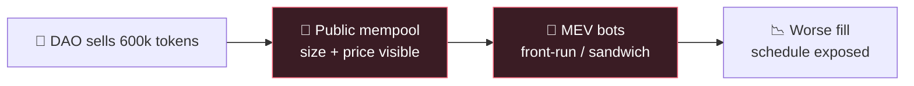
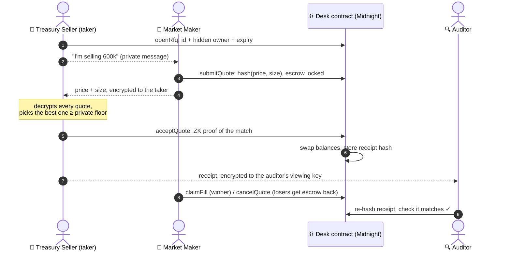
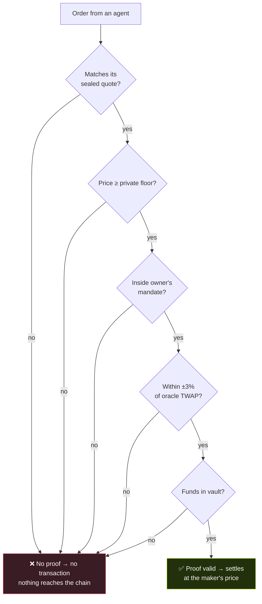
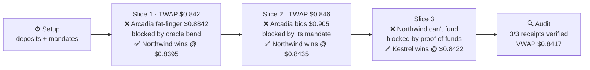
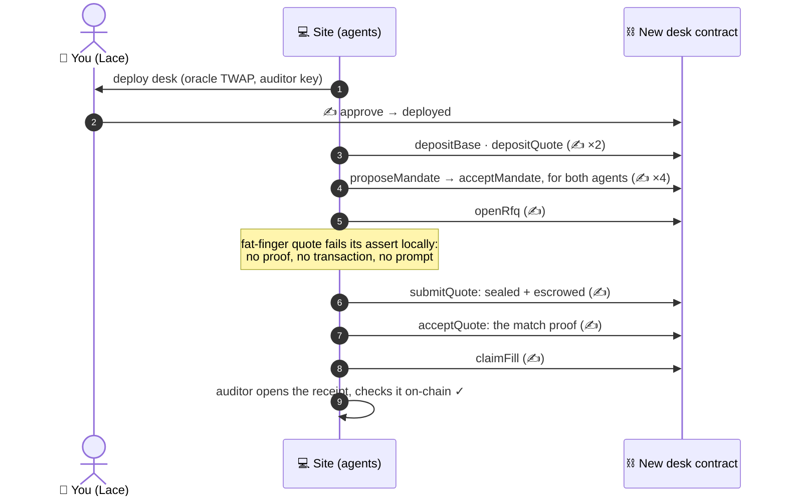
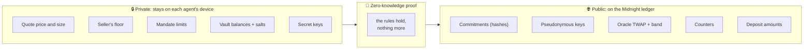
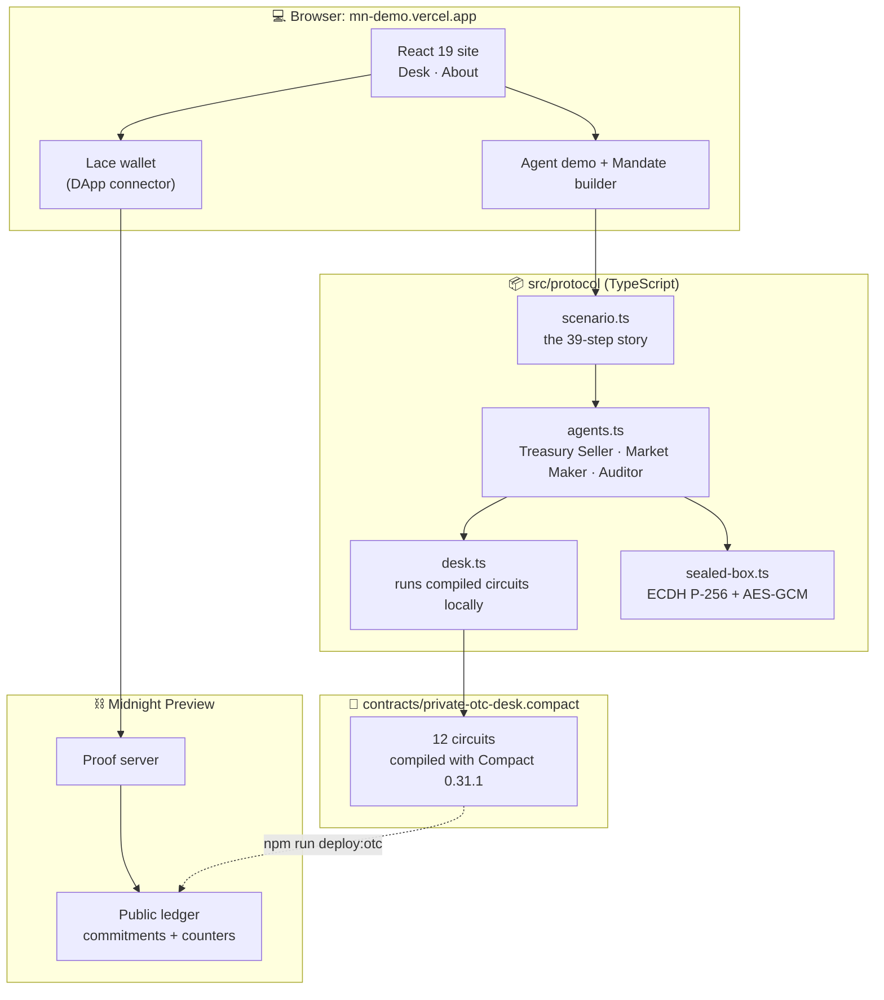
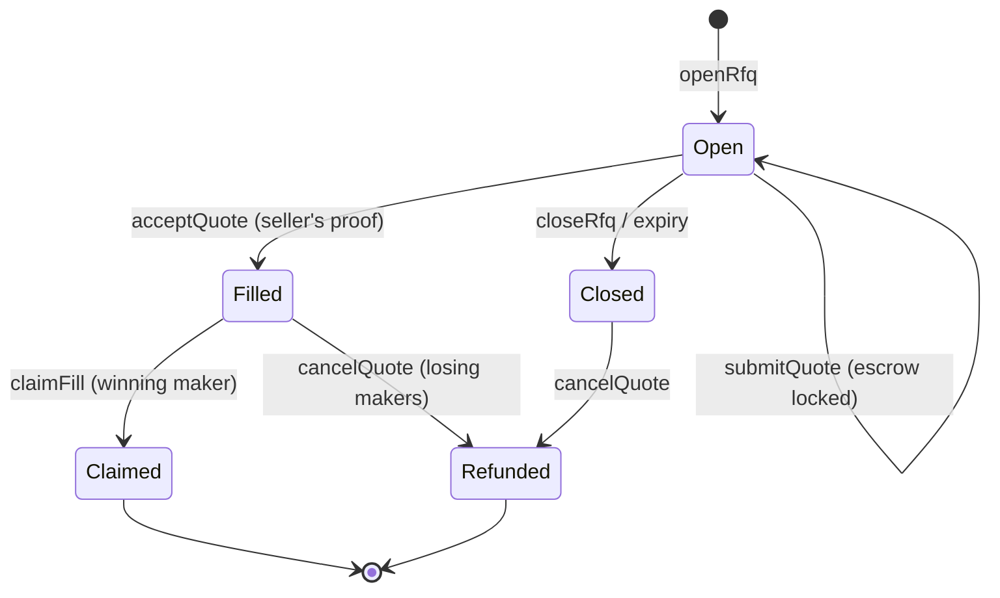
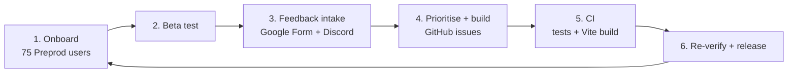
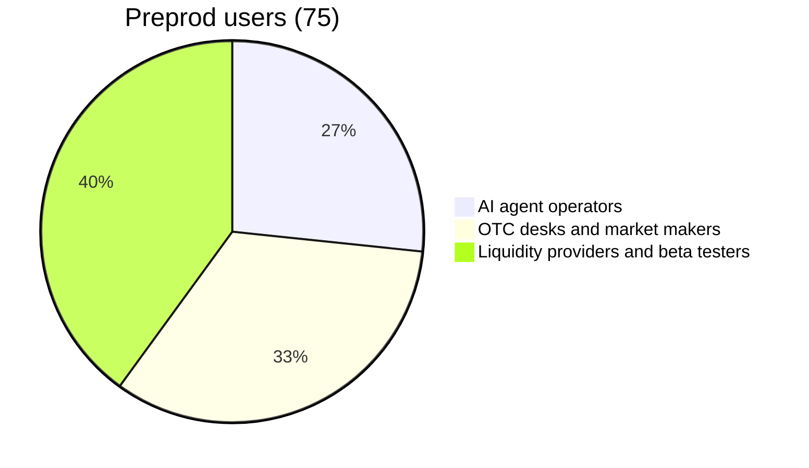

<h1 align="center">🌑 Private OTC Agent Desk</h1>

<p align="center">
  <b>A sealed-RFQ trading desk on Midnight for DAO treasuries, market makers and AI agents.</b><br/>
  Nobody sees the order until it's filled.
</p>

<p align="center">
  <a href="https://github.com/avishrakshe/Private-OTC-Agent-Desk-On-Midnight-/actions/workflows/ci.yml"></a>
  
  
  
  
  
  
</p>

<p align="center">
  <a href="https://mn-demo.vercel.app"><b>🌐 Live app</b></a> ·
  <a href="https://youtu.be/Ysz9uTXDtuY?si=oebajrsBWnGRnupm"><b>🎬 Demo video</b></a> ·
  <a href="https://preview.midnightexplorer.com/contracts/d4ae65cdc6f13c56501334ad07c700be7bdbf5c85baee4b35f380b5a2fbce7cf"><b>📜 RFQ contract on Preview</b></a> ·
  <a href="https://docs.google.com/spreadsheets/d/1iuWNiVUKfM9El9lmTQdEXE1M6z9w0tdB7-yvh9sfyJs/edit?usp=sharing"><b>📊 Feedback sheet</b></a>
</p>

---

## ✨ In 30 seconds

Selling a large block of tokens on a public exchange tells the whole market what you're about to do, and bots trade against you before your order fills.

**Private OTC Agent Desk** moves block trades into a **sealed request for quote (RFQ)** on [Midnight](https://midnight.network), a blockchain built for zero-knowledge privacy:

- 🔒 **Market makers commit to their quotes.** The chain stores a hash, not a price.
- 🧮 **The seller proves the match in zero knowledge:** "this quote beats my private floor." Nobody else learns the floor or the price.
- 🤖 **AI agents trade under a mandate** their owner committed to on-chain. They can't break it, and nobody can read it.
- 💰 **Every quote is backed by escrow**, every price is checked against an oracle band, and an **auditor** can verify every trade with a viewing key.

> **Try it without a wallet:** open the [live app](https://mn-demo.vercel.app), scroll to **Agents** and press **Run the desk**. It runs the real compiled contract in your browser.

---

## 📑 Contents

1. [The problem](#-the-problem)
2. [How it works](#-how-it-works)
3. [Features: the six protocol guarantees](#-features-the-six-protocol-guarantees)
4. [Agents: the demo story](#-agents-the-demo-story)
5. [What the chain sees](#-what-the-chain-sees)
6. [Website tour](#-website-tour)
7. [Architecture](#-architecture)
8. [Smart contract](#-smart-contract)
9. [Deployments](#-deployments)
10. [Getting started](#-getting-started)
11. [Testing](#-testing)
12. [Repository structure](#-repository-structure)
13. [Scope and roadmap](#-scope-and-roadmap)
14. [Documentation and community](#-documentation-and-community)

---

## 🧨 The problem

On a public DEX, an order is visible **before** it executes: its size, its limit price and the wallet sending it. Searcher bots read that signal and front-run it, sandwich it, or trade ahead of the rest of a schedule.



It hurts most on the trades that matter:

| Who | Pain |
|---|---|
| 🏦 **DAO treasuries** | Diversifying out of the native token crashes its price |
| 🔓 **Token unlocks** | Teams and funds selling vested tokens into a thin public book |
| 📈 **Market makers** | Can't fill size without revealing inventory and limits |
| 🤖 **AI treasury agents** | Their owners can't bound what the agent does, and the strategy is public the moment it trades |

MEV happens before execution, so **pre-trade privacy is the product.**

---

## ⚙️ How it works

### Why an RFQ?

A zero-knowledge prover has to know every private input. The buyer's price and the seller's limit belong to two different people, so no single party could prove `bid ≥ ask` over both. The desk uses the model real OTC desks use, the **request for quote**. That way the one party who legitimately knows both numbers, the taker, does the proving.

### The flow in four steps



1. **Ask.** The seller opens an RFQ. On-chain there's only an id and a hidden owner; the size goes privately to the makers it chose.
2. **Quote.** Each maker posts `commit(price, size)` and locks `price × size` from its vault. The opening goes only to the seller, encrypted.
3. **Match.** The seller's agent proves in `acceptQuote` that the quote matches its commitment, that `price ≥ its private floor`, and that the trade is inside its mandate, the oracle band and its funds. **The trade clears at the maker's quote.**
4. **Audit.** A receipt commitment is stored. The auditor opens it with its viewing key and checks it against the chain.

---

## 🛡️ Features: the six protocol guarantees

These are properties of the contract, not of any one agent. **If an order breaks one, no proof exists, so no transaction exists.**

| # | Guarantee | What it means | Enforced in |
|:-:|---|---|---|
| 1 | 🔒 **Pre-trade privacy** | RFQs, quotes and fills go on-chain only as commitments. Nothing to front-run. | `openRfq` · `submitQuote` · `acceptQuote` |
| 2 | 📜 **ZK agent mandates** | The owner proposes a private policy (max notional, price floor and ceiling) and the agent accepts it. Every order proves it's inside the policy without revealing it. | `proposeMandate` · `acceptMandate` · `checkMandate` |
| 3 | 💰 **Proof of funds + escrow** | Vaults hold balance commitments. A quote must be fully backed and locks its funds when posted; the seller proves it holds what it sells. | `depositBase/Quote` · `submitQuote` · `acceptQuote` |
| 4 | 📏 **Oracle price band** | Every price is proven within ±3% of the public oracle TWAP, at quote time and again at match time. Stops fat fingers and manipulation. | `checkOracleBand` · `postOraclePrice` |
| 5 | 🔍 **Selective disclosure** | Each fill stores a receipt commitment; its opening is encrypted to the auditor's registered viewing key. Regulators see trades, not strategies. | `receipts` · `auditorKey` |
| 6 | ⭐ **Reputation from history** | Fill rate comes from counters the contract increments itself. No self-reported scores to fake. | `quotesPosted` · `fillsSettled` |



---

## 🤖 Agents: the demo story

The site runs reference agents that trade under those guarantees. They're about 250 lines of TypeScript ([`src/protocol/agents.ts`](src/protocol/agents.ts)) on top of the contract. Any agent that can hold a key and call circuits gets the same guarantees.

| Agent | Role | Private to it |
|---|---|---|
| 🏦 **Treasury Seller** | DAO agent selling **1.8M DAO** in 3 TWAP slices | Floor price $0.83, mandate from the DAO multisig, vault balances |
| 🤖 **Northwind MM** | Bids 30 bps under TWAP. Tightest price, smallest balance sheet | Spread, inventory, mandate |
| 🤖 **Kestrel Liquidity** | Bids 45 bps under TWAP. Deep USDC vault | Spread, inventory, mandate |
| 🤖 **Arcadia Flow** | Bids 180 bps under TWAP. Its agent has bugs the circuits catch | Spread, inventory, mandate |
| 🔍 **Auditor** | Holds the viewing key and verifies every trade afterwards | Trade receipts (not strategies) |

### What happens (39 steps, all against the compiled contract)



**Result:** 1,800,000 DAO sold for about **$1.515M**. Three bad orders were blocked inside the circuit, and **zero prices or sizes reached the chain**. Losing makers got their escrow back.

Run it in the terminal:

```bash
npm run agents
```

```text
11. [Arcadia Flow] Fat-finger quote at $0.8842 blocked by the oracle band  ✕ REJECTED  (submitQuote)
     private │ Circuit: Price is above the oracle band
     chain   │ (nothing: no proof, no transaction)

16. [Treasury Seller] Match proven and settled at the maker's price  ✓  (acceptQuote)
     private │ Sold 600,000 DAO to Northwind MM at $0.8395
     chain   │ ~ baseVaults[10989e…1499] = 2feccb…cba3
     chain   │ + receipts[e2fc0b…9017] = 18bd4a…c273
     chain   │ - rfqs[e2fc0b…9017]
```

### On-chain, through your Lace wallet

The same agent code runs against a real network. Switch the Agents section to **On Midnight (Lace)**: the site deploys a fresh desk from your wallet and runs one full RFQ round, with every step proved and approved in Lace.



That's 11 transactions in all, with fees paid in DUST. The agents' keys exist only in your browser tab. From the terminal, the same round runs with a seed wallet:

```bash
npm run agents:onchain                        # local devnet
npm run agents:onchain -- --network preview   # Preview
```

---

## 👁️ What the chain sees



| Data | Public DEX | This desk |
|---|---|---|
| Order size / quote price | Broadcast before execution | Commitment; opened only by the counterparty (and the auditor) |
| Seller's limit | Readable by any searcher | Proven ≤ quote, revealed to **nobody** |
| Agent mandate | n/a | Commitment; proven on every order |
| Balances | Public | Commitments. **Deposit amounts are public** |
| Who traded | Visible before execution | Pseudonymous keys, visible **at settlement** |
| Oracle TWAP, band, trade count | n/a | Public by design |

The tests check this directly: they record every public transcript and ledger value of a quote and a match, and assert that no price, size, floor, balance or mandate limit appears anywhere, **not even as raw bytes**.

---

## 🖥️ Website tour

The site ([`src/pages`](src/pages)) has two pages.

### Desk page (`#/`)

| Section | What you can do | Real or illustrative? |
|---|---|---|
| **Hero + Desk Terminal** | Overview dashboard with volume, depth and settlements | Illustrative demo data (labelled) |
| **Features** | The four headline guarantees, each with a widget | Explainer |
| **Who it's for** | DAO treasuries, token unlocks, market makers, AI treasury agents | Explainer |
| **Agents** ⭐ | **Instant (local):** run or step through the 39-step story, each step showing the agent's private view next to what the chain sees. **On Midnight (Lace):** deploy a fresh desk from your wallet and run one RFQ round as 11 real transactions | Local mode runs the compiled circuits in your browser; **Lace mode is fully on-chain** |
| **Mandate builder** ⭐ | Set a max notional and a price floor/ceiling, place an order, tick "compromised agent" and watch the circuit block it | **Runs the real `submitQuote` circuit** |
| **Under the hood** | Interactive list of all six guarantees | Explainer |
| **Connect, prove, settle** | Connect Lace and send a real proof + transaction to Midnight Preview | **Real on-chain transaction** (`storeMessage` demo contract) |
| **Match proof preview** | Drag the sealed quote, your floor and your escrow, then flip to the chain's view | Browser-only preview |
| **FAQ** | Who proves the match, what price trades clear at, what's public, what stops defaults | |

### About page (`#/about`)

The problem (public vs private flow, animated) · the four pillars · the `acceptQuote` circuit with private, proven and public lines highlighted · a "who sees what" matrix · **honest scope and roadmap** · the stack.

---

## 🏗️ Architecture



### Lifecycle of an RFQ and its quotes



Quotes are **firm** while the RFQ is open, so a maker can't pull its quote after seeing the book (there's no book to see anyway).

---

## 📜 Smart contract

Source: [`contracts/private-otc-desk.compact`](contracts/private-otc-desk.compact). Compiled output lives in [`contracts/managed/private-otc-desk`](contracts/managed/private-otc-desk).

| Circuit | Who calls it | What it proves or does |
|---|---|---|
| `postOraclePrice` | Oracle key | Updates the TWAP |
| `depositBase` / `depositQuote` | Anyone | Adds to a vault; the amount is public, the resulting balance isn't |
| `proposeMandate` → `acceptMandate` | Owner → agent | Two-step mandate: the owner proposes a commitment, the agent proves the opening to activate it. Once bound, only that owner can replace it |
| `revokeMandate` | Owner | Removes the agent's mandate immediately |
| `openRfq` | Seller | Registers an RFQ with a hidden owner and expiry |
| `submitQuote` | Maker | RFQ open · mandate · oracle band · `balance ≥ price×size` → escrow + sealed quote |
| `acceptQuote` | Seller | Owns the RFQ · opening matches · `price ≥ floor` · mandate · band · funds → settle at the maker's price |
| `closeRfq` | Seller | Close without filling |
| `claimFill` | Winning maker | Collect the tokens bought |
| `cancelQuote` | Losing / expired maker | Release escrow |

**Units:** prices are USDC micro-units (6 decimals) per whole token, and sizes are whole tokens. Pure helpers (`quoteCommitment`, `receiptCommitment` and so on) let off-chain code compute exactly the same hashes. Full reference: [docs/API_REFERENCE.md](docs/API_REFERENCE.md).

<details>
<summary><b>The match proof (condensed <code>acceptQuote</code>)</b></summary>

```compact
export circuit acceptQuote(rfqId, ownerSalt, maker, terms: QuoteTerms, termsSalt,
                           floorPrice: Uint<64>, mandate: Mandate, mandateSalt, …): [] {
  const taker = callerKey();
  assert(rfqs.lookup(rfq).owner == ownerCommitment(taker, ownerSalt), "Only the RFQ requester can accept a quote");
  assert(q.terms == quoteCommitment(terms, termsSalt), "Quote opening does not match the sealed quote");

  // Sealed match: the maker's quote clears the taker's private floor. Clearing price = maker's quote.
  assert(terms.price >= floorPrice, "Quote is below the taker's private floor");

  checkMandate(taker, mandate, mandateSalt, terms.price, terms.price * terms.size);
  checkOracleBand(terms.price);
  openBase(taker, baseBalance, baseSalt);
  assert(baseBalance >= terms.size, "Insufficient BASE funds to fill this quote");
  // … rotate vault commitments, store receipt commitment, bump counters
}
```
</details>

---

## 🚀 Deployments

| Network | Contract | Address |
|---|---|---|
| **Midnight Preview** | 🟢 Sealed RFQ desk (`private-otc-desk.compact`) | [`d4ae65cdc6f13c56501334ad07c700be7bdbf5c85baee4b35f380b5a2fbce7cf`](https://preview.midnightexplorer.com/contracts/d4ae65cdc6f13c56501334ad07c700be7bdbf5c85baee4b35f380b5a2fbce7cf) |
| **Midnight Preview** | 🟢 `storeMessage` demo used by the live transaction panel (`hello-world.compact`) | [`7f0643b12f38f45c7fef2e125543466ee7b8ea8a615800cd7ec0b0bd71127ae1`](https://preview.midnightexplorer.com/contracts/7f0643b12f38f45c7fef2e125543466ee7b8ea8a615800cd7ec0b0bd71127ae1) |

| **Midnight Preview** | 🟢 Desk deployed **by the agents** in a full on-chain round (`npm run agents:onchain -- --network preview`): 11 transactions, receipt verified by the auditor | [`c2a3fcc0f798f6314e59c698dbab562fa650fcf7feefd6e0edad25a8dc972219`](https://preview.midnightexplorer.com/contracts/c2a3fcc0f798f6314e59c698dbab562fa650fcf7feefd6e0edad25a8dc972219) |

The RFQ desk was deployed with an oracle TWAP of $0.842, a ±3% band and an auditor viewing key. An earlier Preview deployment (`07f477d1…`) predates the security fixes in [docs/SECURITY.md](docs/SECURITY.md) and shouldn't be used.

---

## 🧰 Getting started

### Prerequisites

- **Node.js 22+**
- **Docker** (for the local proof server, and for the Compact compiler if you don't have it installed)
- **Lace wallet** with Midnight enabled, set to **Preview**, only if you want to send the live transaction

### Run the site

```bash
git clone https://github.com/avishrakshe/Private-OTC-Agent-Desk-On-Midnight-.git
cd Private-OTC-Agent-Desk-On-Midnight-
npm install
npm run dev          # → http://localhost:5173
```

### Useful commands

| Command | What it does |
|---|---|
| `npm run agents` | Runs the Treasury Seller vs Market Makers story in the terminal (instant) |
| `npm run agents:onchain [-- --network preview]` | Deploys a fresh desk and runs one RFQ round as real transactions |
| `npm test` | 13 protocol tests against the compiled contract |
| `npm run typecheck` | Typechecks the site, protocol, scripts and tests |
| `npm run build` | Production build into `dist/` |
| `npm run proof-server:start` | Starts the local node, indexer and proof server (Docker) |
| `npm run health-check [-- --network preview]` | Probes indexer, node, proof server and ZK keys; exits non-zero on failure |
| `npm run deploy:otc -- --network preview` | Deploys the RFQ contract (creates a wallet, waits for faucet funds) |
| `npm run cli` | Interactive menu: local story, on-chain round, ledger query, balances |
| `npm run benchmark` | Circuit execution time per circuit |

### Compile the contract

Use Compact **0.31.1**, which targets `compact-runtime` 0.16:

```bash
compact update 0.31.1
compact compile contracts/private-otc-desk.compact contracts/managed/private-otc-desk
```

The site serves the ZK artifacts from `public/managed/private-otc-desk/`; copy `keys/` and `zkir/*.bzkir` there after recompiling. `npm run deploy:otc` writes the oracle key and the auditor's viewing key to `.otc-desk-keys.json` (gitignored, backed up on redeploy). **Back that file up**, and set `PRIVATE_STATE_PASSWORD` on public networks. See [docs/USAGE.md](docs/USAGE.md) for a Docker-based compile.

---

## 🧪 Testing

```bash
npm test
```

```text
▶ Private OTC Agent Desk: sealed RFQ protocol (compiled Compact circuits)
  ✔ a) Circuit logic: taker proves quote ≥ private floor and settles at the maker's quote
  ✔ b) State transitions: escrow locks at quote time and is released for losing makers
  ✔ c) Privacy: prices, sizes, floors and balances never reach the public ledger or transcript
  ✔ d) Constraint enforcement: no valid proof exists for a bad trade
  ✔ d) Mandates: agents cannot trade outside the policy their owner committed to
  ✔ d) Mandates are two-step: a squatter cannot bind or block an agent
  ✔ d) Oracle band: prices outside ±band of the TWAP are unprovable, and only the oracle key can move it
  ✔ d) Expiry: quotes can't be posted or accepted after the RFQ expires; escrow is then released
  ✔ d) RFQ ids are single-use: a filled or closed RFQ cannot be reopened to overwrite its receipt
  ✔ e) Selective disclosure: the auditor opens receipts with its viewing key and matches them on-chain
  ✔ f) End-to-end: Treasury Seller sells 1.8M DAO to three Market Makers via sealed RFQ
  ✔ g) Hardening: the taker ignores quote envelopes that don't match what the maker committed on-chain
  ✔ g) Hardening: sealed envelopes reject tampering and wrong recipients
ℹ tests 13 · pass 13 · fail 0
```

The tests execute the JavaScript the Compact compiler generated, **including every `assert`**, against real ledger state via `@midnight-ntwrk/compact-runtime`. The same flow is also exercised with real proofs and transactions by `npm run agents:onchain`. CI runs typecheck, tests and the production build on every push.

Security review, threat model and known limitations: [docs/SECURITY.md](docs/SECURITY.md).

---

## 📂 Repository structure

```text
├── contracts/
│   ├── private-otc-desk.compact      # ⭐ Sealed RFQ desk (12 circuits)
│   ├── hello-world.compact           # storeMessage demo used by the live panel
│   ├── counter.compact · otc-order-matcher.compact   # earlier levels
│   └── managed/                      # compiler output (JS, ZKIR, keys)
├── public/managed/                   # ZK artifacts served to the browser (Lace proving)
├── src/
│   ├── protocol/                     # ⭐ the desk client
│   │   ├── desk.ts                   #    Desk interface · local executor · ledger diffs
│   │   ├── chain.ts                  #    OnChainDesk · deployDesk (Midnight.js)
│   │   ├── agents.ts                 #    Treasury Seller · Market Maker · Auditor
│   │   ├── scenario.ts               #    the 39-step story (local)
│   │   ├── onchain-round.ts          #    one RFQ round as 11 real transactions
│   │   ├── sealed-box.ts             #    encryption for quotes and viewing keys
│   │   └── sandbox.ts                #    one-shot circuit runs for the site
│   ├── pages/                        # DeskPage · AboutPage
│   ├── components/
│   │   ├── agents/                   # AgentDesk (local + Lace modes) · MandateBuilder
│   │   ├── showcase/                 # features, widgets, FAQ
│   │   ├── terminal/ · charts/ · three/ · ui/
│   │   ├── SealedBidSimulator.tsx    # match proof preview
│   │   └── CircuitCall.tsx · WalletConnect.tsx   # live Lace transaction
│   ├── hooks/useMidnight.ts          # Lace connector · buildProviders
│   ├── node-providers.ts             # seed wallet, DUST, retrying submit (Node)
│   └── deploy.ts · cli.ts · network.ts · wallet.ts
├── scripts/                          # run-agents(-onchain) · health-check · benchmark · e2e
├── tests/otc-desk.test.ts            # 13 tests against the compiled contract
├── docs/                             # API reference · architecture · usage · security
├── FEEDBACK.md · USERS.md · PROPOSAL.md
└── docker-compose.yml                # local node, indexer, proof server
```

### Tech stack

| Layer | Tools |
|---|---|
| Smart contract | Midnight **Compact** (compiler 0.31.1, language 0.23) |
| ZK runtime | `@midnight-ntwrk/compact-runtime` 0.16, Midnight.js 4.1 |
| Frontend | React 19 · TypeScript · Vite 8 |
| Wallet | Lace via `@midnight-ntwrk/dapp-connector-api` |
| Crypto (off-chain) | WebCrypto: ECDH P-256 + HKDF + AES-256-GCM |
| Testing / CI | Node test runner (`tsx --test`) · GitHub Actions |
| Hosting | Vercel |

---

## 🗺️ Scope and roadmap

| ✅ Built | ⚠️ Scope today | 🔭 Roadmap |
|---|---|---|
| Sealed RFQ: commit, encrypted quote, seller's match proof | One Midnight-native pair per contract; vault balances accounted in-contract | SDK + **MCP server** so any agent can quote, commit and settle; x402-style fees |
| Proof of funds with escrow at quote time | Sell-side RFQs (the treasury flow); buy-side is the mirror circuit | Real shielded token escrow; cross-chain settlement via HTLCs |
| ZK agent mandates | Deposit amounts are public; balances after that are not | Maker bonds with slashing; NightPass / AttestPass identity |
| Oracle TWAP band at quote + match | Oracle is a single posting key | Multi-signer oracle |
| Auditor receipts + viewing key | Vaults are accounting-only: deposits aren't backed by real tokens, so don't use with value | Sealed batch auctions, MPC/TEE matching |
| History-based reputation · reference agents | The on-chain round uses one maker; the three-maker story runs locally | Iceberg orders, size-bucket IOIs, delayed aggregate reporting |
| Agents deploy and trade on Midnight through Lace · deployed on Preview | | |

---

| Deliverable | Link |
|---|---|
| **Live web app** | [mn-demo.vercel.app](https://mn-demo.vercel.app) |
| **Demo video** | [YouTube walkthrough](https://youtu.be/Ysz9uTXDtuY?si=oebajrsBWnGRnupm) |
| **Source code** | [GitHub](https://github.com/avishrakshe/Private-OTC-Agent-Desk-On-Midnight-) |
| **Feedback form** | [Google Form](https://docs.google.com/forms/d/e/1FAIpQLSfLwxO_XuvqTr78an-xnS0GPSlay3ZHFDSHeELxKrc5Ncfw5A/viewform?usp=publish-editor) |
| **Feedback responses** | [Public Google Sheet](https://docs.google.com/spreadsheets/d/1iuWNiVUKfM9El9lmTQdEXE1M6z9w0tdB7-yvh9sfyJs/edit?usp=sharing) |
| **User registry** | [USERS.md](USERS.md) |
| **Feedback and iteration report** | [FEEDBACK.md](FEEDBACK.md) |

> [!IMPORTANT]
> **Mandatory user feedback sheet (Level 5 and Level 6):**
> - 📊 **Public live Google Sheet:** [Private OTC Agent Desk — User Feedback Spreadsheet](https://docs.google.com/spreadsheets/d/1iuWNiVUKfM9El9lmTQdEXE1M6z9w0tdB7-yvh9sfyJs/edit?usp=sharing)
> - 📝 **Intake Google Form:** [Private OTC Agent Desk — User Feedback Form](https://docs.google.com/forms/d/e/1FAIpQLSfLwxO_XuvqTr78an-xnS0GPSlay3ZHFDSHeELxKrc5Ncfw5A/viewform?usp=publish-editor)
>
> All 75 beta tester responses, ratings, bug reports and UX suggestions are collected and tracked publicly in this sheet.

### Feedback loop



### Beta programme metrics

| Metric | Value |
|---|---|
| Preprod users onboarded | **75** wallet addresses (requirement: 50) |
| Testnet swaps settled during beta | **250+** |
| Average client-side proof time (beta) | **8.4 s** |
| Average satisfaction rating | **4.9 / 5** (Google Form responses) |
| Commits | **67** (requirement: 20) |

### Feedback → implementation

| User | Feedback | What we built | Commit |
|---|---|---|---|
| **USR-003** Marcus Vance | Lace connection hung silently when the wallet was locked or on the wrong network | Network validation and unlock alerts in `useMidnight.ts` / `WalletConnect.tsx` | [`4dbb325`](https://github.com/avishrakshe/Private-OTC-Agent-Desk-On-Midnight-/commit/4dbb32552508ea96e5d8f919ec70c555ab3c517d) |
| **USR-008** Hannah Taylor | Unsure whether the proof was running during the wait | Real-time progress pipeline (key load → witness → proof → submit) | [`b2ecee3`](https://github.com/avishrakshe/Private-OTC-Agent-Desk-On-Midnight-/commit/b2ecee3e68503831ba867bce57d0deec2a99ae81) |
| **USR-004** Sarah Chen | Institutions wanted counterparty assurance before trading | First a reputation-threshold circuit; now reputation derived from on-chain fill history plus escrowed quotes | [`c9c3ae4`](https://github.com/avishrakshe/Private-OTC-Agent-Desk-On-Midnight-/commit/c9c3ae493ccd41e611e3c7e5fa6055de6b1ff017) |
| **USR-037** Mason Martin | Wanted Preprod and Preview deployments | Deployments on both testnets | [`a628a14`](https://github.com/avishrakshe/Private-OTC-Agent-Desk-On-Midnight-/commit/a628a14262464bdee03f15dff0423a94e329a359) |
| **USR-069** Ezra Bell | Wanted CI to prevent regressions | GitHub Actions running tests and the production build on every push | [`e117fa3`](https://github.com/avishrakshe/Private-OTC-Agent-Desk-On-Midnight-/commit/e117fa3e52a5c5d3a2c24f4cb1c8d92815778a22) |

### Users registry



| User | Role | Wallet |
|---|---|---|
| USR-001 | Lead deployer / agent master node | `mn_addr_preprod190sdeeta9lnxjav3vh8z83znzmrz9dnvy4a6e62mry3ql9y7739sfupum2` |
| USR-002 | Institutional trading desk | `mn_addr_preprod13a96fwj4a2x32vsqf5v3070nsqa7pvg983u4e07n0z5m9r7w1q8s6x87p` |
| USR-071 | Primary protocol operator | `mn_addr_preprod1lsvj6sml93yqacpwhded6srkjhmvtvew4hn3esypjml72hert6es3td2t4` |

👉 The full list of 75 addresses is in [USERS.md](USERS.md).

---

## 📚 Documentation and community

| Document | Contents |
|---|---|
| [docs/API_REFERENCE.md](docs/API_REFERENCE.md) | Ledger, circuits and TypeScript usage for the RFQ desk |
| [FEEDBACK.md](FEEDBACK.md) | User testing, metrics and iteration log |
| [USERS.md](USERS.md) | 75 verified Preprod wallet addresses |
| [PROPOSAL.md](PROPOSAL.md) | Original proposal |
| [docs/ARCHITECTURE.md](docs/ARCHITECTURE.md) | Components, local vs on-chain backends, contract state, keys |
| [docs/USAGE.md](docs/USAGE.md) | Using the site (instant and Lace modes), CLI, compiling |
| [docs/SECURITY.md](docs/SECURITY.md) | Trust model, findings fixed in the security review, known limitations |

**Community:** 🐦 [@DefiAipy](https://x.com/DefiAipy) · 👨‍💻 [@ARakshe34041](https://x.com/ARakshe34041) · 💬 [Discord](https://discord.gg/ZgPFTXD8Q) · 📢 [Telegram](https://t.me/+wD5ySwGdCwo2MTg1)

<p align="center"><sub>Built on <b>Midnight</b>. MIT licensed.</sub></p>
