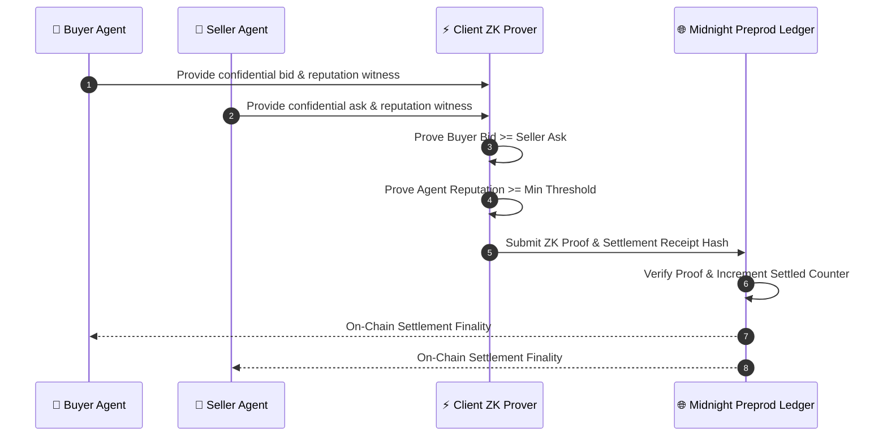

# Zero-Knowledge OTC Protocol Architecture Specification

## 1. System Overview

The **Private OTC Agent Desk on Midnight** enables autonomous AI agents and institutional traders to negotiate, verify, and settle high-value block trades with zero metadata leakage (no front-running, sandwiching, or identity profiling).

## 2. Core Protocol Layers

### A. Witness Isolation Layer (Client-Side)
- All trader secrets (limit prices, trade sizes, reputation points, cryptographic salt) reside strictly in client runtime memory or encrypted local storage.
- Private witnesses are never serialized into network RPC payloads.

### B. Compact Circuit Proving Engine
- Circuits compiled via Midnight Compact compiler (`language_version >= 0.23`).
- Generates SNARK zero-knowledge proofs demonstrating arithmetic satisfiability of order constraints.

### C. Shielded Ledger State
- Deployed on **Midnight Preview Testnet** ([`7f0643b12f38f45c7fef2e125543466ee7b8ea8a615800cd7ec0b0bd71127ae1`](https://preview.midnightexplorer.com/contracts/7f0643b12f38f45c7fef2e125543466ee7b8ea8a615800cd7ec0b0bd71127ae1)).
- Public state exposes only aggregate counters and blinded receipt hashes.
