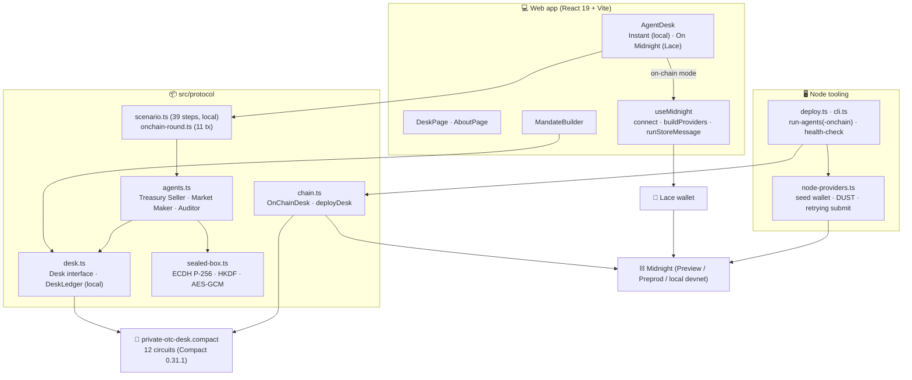
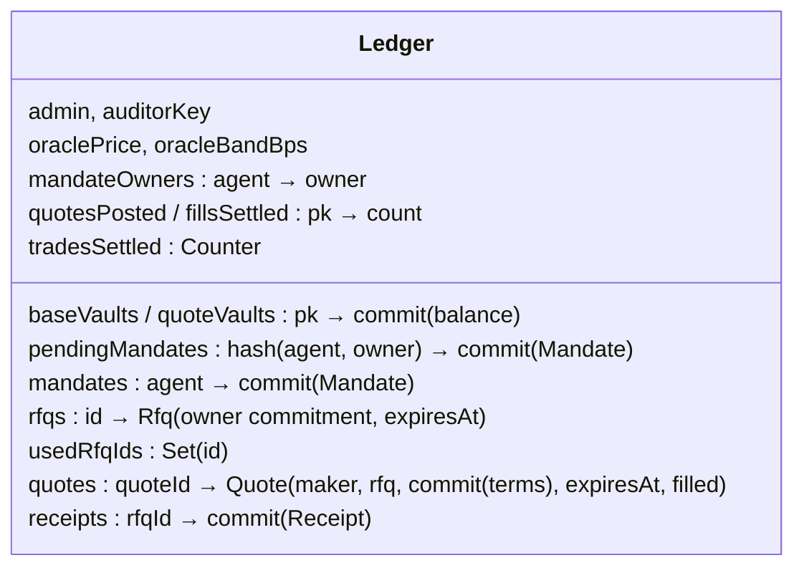
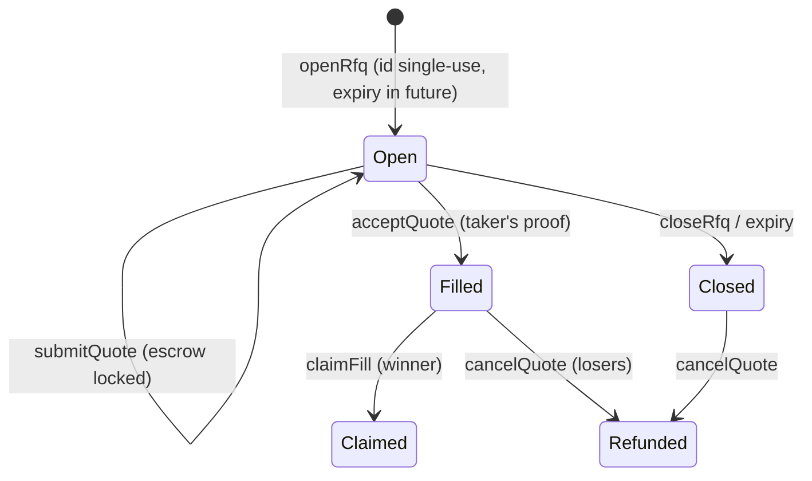

# Architecture

## Components

**One agent codebase, two backends.** Agents program against the `Desk` interface:

| | `DeskLedger` (local) | `OnChainDesk` (network) |
|---|---|---|
| Executes | the compiled circuits' JS, every `assert` included | the same, then proves and submits |
| State | in-memory ledger | the deployed contract, read via the indexer |
| Used by | tests, instant demo, mandate builder, `npm run agents` | Lace mode on the site, `npm run agents:onchain`, the CLI |
| Time | explicit (deterministic tests) | wall clock |

A failed `assert` raises `CircuitRejected` in both. On-chain it happens while the circuit runs locally, **before anything is proved or submitted**, so a bad order costs nothing and reveals nothing.

## Contract state

Identity is `publicKey(sk) = persistentHash("otc-desk:pk:v1", sk)`. The secret key reaches circuits only through the `secretKey()` witness, from each caller's private state.

## Lifecycle

## Off-chain messages

| Message | From → to | Protection |
|---|---|---|
| IOI (RFQ id, size, expiry, reply key) | taker → chosen makers | point-to-point (in-process in the demo) |
| Quote opening (price, size, salt) | maker → taker | sealed box to the taker's key; verified against `quotes[…].terms` before use |
| Mandate opening | owner → agent | point-to-point; the agent proves it in `acceptMandate` |
| Receipt opening | taker → auditor | sealed box to the viewing key whose fingerprint is `auditorKey` |

## Keys

| Key | Where it lives |
|---|---|
| Agent / owner secret keys | Midnight.js private state (LevelDB in Node; memory in the browser tab) |
| Oracle key, auditor viewing key (CLI deploy) | `.otc-desk-keys.json` (gitignored, backed up on redeploy) |
| Oracle key, auditor viewing key (browser deploy) | memory of the tab that deployed |
| Wallet seeds (Node) | `.midnight-state.json` or `MIDNIGHT_WALLET_SEED` |

See [SECURITY.md](SECURITY.md) for the threat model and limitations.
